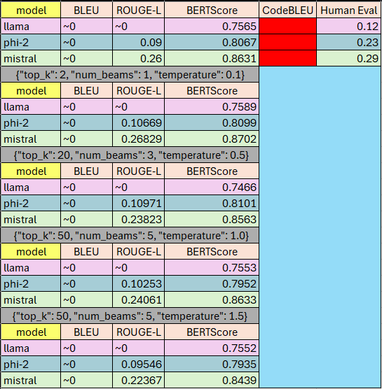

# How to run code

## 1. Create Conda Environment:

**conda env create -f environment.yml**

## 2. Activate Conda Environment:

**conda activate env**

## 3. Fine-Tune a model:

**Fine-tuning models are done with traning_script.py**
In this script users are able to chage the base_model variable with a HuggingFace Repo \n
to perform instruction fine-tuning on the Alpaca instruction datset (currently available in alpaca_data.json)

## Discussion:

**Fine tuning discussion**
The initial results of fine-tuning do not indicate a strong response. My hypothosis is the model was under trained during the fine tuning process due to hardware limitations.
Future work will include exploring other quantization methods, other libraries such as DeepSpeed and Unsloth, and continuing to learn more about LoRA, QLoRA, and PeFT.

The metrics used to evaluate the models explored in this work are bilingual evaluation understudy (BLEU), Recall-Oriented Understudy for Gisting Evaluation (ROUGE) - Longest Common Subsequence (LCS), and BERTScore.

- BLEU is a widely used metric for evaluating generated text. It is important to note that this and the proceeding metrics do require a *ground truth* reference. At its core, BLEU determines the precision of contiguous sequences of text - known as N-Grams. The calculatrion for this looks at a 1-word, 2-word, 3-word, and 4-word sequence of words in the generated text and then compares it to the ground truth to evaluate the precision of the generated text. These scores can range from 0 to 1, where 1 means perfect overlap with the ground truth text.

#TODO - Add base model performance to the results.png

